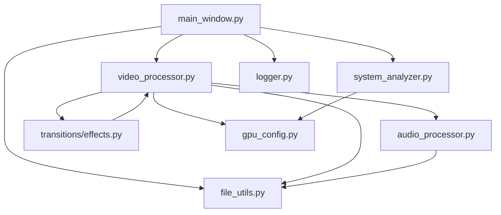

# 视频混剪工具系统设计蓝图

## 1. 文档信息
**项目名称**：视频混剪工具  
**编写日期**：2023-06-15  
**负责人**：  
**版本号**：1.0.0  

## 2. 项目概览

### 项目定位
视频混剪工具是一款桌面应用程序，旨在提供简单高效的视频混剪功能。用户可以通过导入素材文件夹，自动随机选择视频片段，添加转场效果和背景音乐，快速生成完整的视频作品。该工具特别适合需要批量生成视频内容的用户，支持GPU硬件加速以提高处理效率。

### 目标用户
- 内容创作者：需要快速剪辑和混合视频素材的创作者
- 社交媒体运营人员：需要批量生成视频内容的运营者
- 普通用户：无专业视频编辑经验但需要简单视频处理功能的用户

### 核心功能概览
1. 素材文件夹导入（支持拖拽）
2. 视频片段自动抽取与拼接
3. 多种转场效果支持
4. 音频配音与背景音乐添加
5. 硬件加速编码（支持NVIDIA、Intel、AMD）
6. 批量视频生成
7. 处理进度与时间统计

### 用户使用流程
1. 启动应用程序
2. 导入素材文件夹（可通过拖拽或菜单选择）
3. 设置输出参数（转场效果、编码设置等）
4. 添加背景音乐（可选）
5. 点击"开始合成"按钮
6. 等待处理完成，查看生成的视频文件

## 3. 系统架构设计

### 系统架构

#### 系统分层
- 用户界面层(UI)：提供用户交互界面
- 核心处理层(Core)：负责视频和音频处理的核心逻辑
- 工具层(Utils)：提供文件操作、日志等通用功能
- 硬件管理层(Hardware)：负责硬件检测与配置

#### 模块划分与模块关系
```
src/
├── core/                # 核心处理模块
│   ├── video_processor.py  # 视频处理核心
│   └── audio_processor.py  # 音频处理核心
├── ui/                  # 界面模块
│   └── main_window.py     # 主窗口实现
├── transitions/         # 转场特效模块
│   ├── __init__.py       # 模块初始化
│   └── effects.py        # 各种转场效果实现
├── hardware/            # 硬件管理模块
│   ├── __init__.py       # 模块初始化
│   ├── gpu_config.py     # GPU配置管理
│   └── system_analyzer.py # 系统分析器
└── utils/              # 工具模块
    ├── __init__.py      # 模块初始化
    ├── file_utils.py    # 文件处理工具
    └── logger.py        # 日志系统
```

#### 模块依赖关系


#### 整体技术栈说明
- **语言**：Python 3.8+
  - 选择理由：跨平台支持、丰富的视频处理库、开发效率高
- **UI框架**：PyQt5
  - 选择理由：成熟的跨平台UI框架，支持丰富的控件和自定义样式
- **视频处理**：
  - FFmpeg (命令行调用)：强大的视频编解码引擎，支持硬件加速
  - MoviePy：Python视频处理库，提供简洁的视频剪辑和效果API
  - 选择理由：结合FFmpeg的性能和MoviePy的易用性，实现高效视频处理
- **音频处理**：
  - pydub：Python音频处理库，提供简洁的音频处理接口
  - 选择理由：简化音频操作，适合基础的音频混合和处理
- **硬件加速**：
  - NVIDIA GPU加速：使用NVENC编码器
  - Intel GPU加速：使用QSV编码器
  - AMD GPU加速：使用AMF编码器
  - 选择理由：提高视频处理性能，降低CPU负担
- **辅助库**：
  - logging：日志记录
  - os/pathlib：文件路径处理
  - threading：多线程支持
  - subprocess：进程调用

## 4. 各模块设计

### 4.1 文件处理模块 (utils/file_utils.py)

**模块状态**：✅ 完成  
**版本号**：1.0.0  
**最后更新日期**：2023-05-15  

#### 模块详情

##### 模块概览
文件处理模块负责处理所有与文件系统相关的操作，包括媒体文件识别、文件操作、临时文件管理等。该模块设计为工具类集合，为其他模块提供文件操作支持。

##### 功能点列表
1. 媒体文件识别与分类
2. 文件复制与移动操作
3. 临时文件与目录管理
4. 目录结构维护
5. 文件大小获取
6. 文件锁定检测
7. 磁盘空间检查

##### 接口定义

| 接口名称 | 输入参数 | 返回值 | 描述 |
|---------|---------|--------|------|
| list_media_files | directory: Path, recursive: bool = False | Dict[str, List[Path]] | 列出目录中的媒体文件，分类为视频和音频 |
| list_files | directory: Path, extensions: List[str], recursive: bool = False | List[Path] | 列出指定扩展名的文件 |
| copy_files | source_paths: List[Path], dest_dir: Path | List[Path] | 复制文件到目标目录 |
| move_files | source_paths: List[Path], dest_dir: Path | List[Path] | 移动文件到目标目录 |
| create_temp_file | prefix: str, suffix: str | Path | 创建临时文件 |
| create_temp_dir | prefix: str | Path | 创建临时目录 |
| ensure_dir_exists | directory: Path | bool | 确保目录存在，不存在则创建 |
| clean_temp_dir | directory: Path, older_than: int = 3600 | int | 清理临时目录中的旧文件 |
| get_file_size | file_path: Path | int | 获取文件大小(字节) |

##### 核心处理流程
1. **媒体文件识别**：
   - 根据文件扩展名快速筛选视频和音频文件
   - 按照扩展名列表进行分类
   - 支持递归搜索子目录
   - 返回分类后的媒体文件字典

2. **文件系统操作**：
   - 文件复制：确保目标目录存在，使用shutil复制文件
   - 文件移动：检查目标目录，使用shutil移动文件
   - 临时文件创建：在应用专用临时目录中创建临时文件
   - 目录检查：检查目录是否存在，不存在则创建

##### 技术实现要点
- 使用Path对象处理路径，提高跨平台兼容性
- 通过文件扩展名进行初步媒体类型识别
- 采用简化的验证策略，减少不必要的验证步骤
- 使用tempfile库创建临时文件和目录
- 使用shutil进行文件复制和移动操作

##### 技术选型说明
- **pathlib.Path**：使用Path对象而非字符串处理路径，提高跨平台兼容性，避免不同系统路径分隔符问题
- **Python标准库**：使用os, shutil, tempfile等标准库进行文件操作，确保跨平台兼容性
- **扩展名验证**：对媒体文件使用简单扩展名检查，而非复杂的内容验证，提高扫描效率
- **独立临时目录**：为应用创建专用临时目录，避免与其他应用冲突，便于管理

##### 技术实现细节
```python
def list_media_files(directory: Path) -> Dict[str, List[Path]]:
    """
    列出指定目录下的媒体文件，分类为视频和音频
    - 使用扩展名进行快速初步识别
    - 支持递归子目录搜索
    - 返回分类后的媒体文件字典
    """
    # 视频和音频扩展名列表
    video_extensions = ['.mp4', '.mov', '.mkv', '.avi', '.wmv', '.flv', '.webm']
    audio_extensions = ['.mp3', '.wav', '.ogg', '.flac', '.aac', '.m4a']
    
    # 获取所有符合扩展名的文件
    videos = list_files(directory, extensions=video_extensions, recursive=recursive)
    audios = list_files(directory, extensions=audio_extensions, recursive=recursive)
    
    return {
        'videos': videos, 
        'audios': audios
    }
```

##### 异常处理与边界情况
1. **文件不存在**：检测文件存在性，不存在时返回空结果或引发自定义异常
2. **权限不足**：捕获权限错误异常，提供友好错误信息
3. **文件被锁定**：在文件操作前检测文件锁定状态，避免操作失败
4. **磁盘空间不足**：在写入大文件前检查可用磁盘空间，预防写入失败
5. **中文路径问题**：在Windows系统中特别处理中文路径，避免编码问题

##### 注意事项
- 媒体文件识别使用简化策略，仅依赖扩展名判断，不进行内容验证
- 文件操作需考虑用户权限问题，提供友好错误信息
- 在Windows系统中，中文路径可能导致问题，需特别处理
- 临时文件需定期清理，避免磁盘空间占用过大

### 4.2 视频处理模块 (core/video_processor.py)

**模块状态**：✅ 完成  
**版本号**：1.2.0  
**最后更新日期**：2023-06-10  

#### 模块详情

##### 模块概览
视频处理模块是系统的核心组件，负责视频片段选择、裁剪、拼接、转场效果应用以及视频导出。该模块支持两种编码模式（重编码和快速不重编码），以及多种硬件加速选项，实现高效视频处理。

##### 功能点列表
1. 素材文件夹扫描与解析
2. 视频片段随机选择与裁剪
3. 视频片段拼接与转场处理
4. 硬件加速视频编码
5. 背景音乐添加
6. 批量视频生成
7. 处理进度反馈与计时

##### 接口定义

| 接口名称 | 输入参数 | 返回值 | 描述 |
|---------|---------|--------|------|
| process_batch | material_folders: List[Dict[str, Any]], output_dir: str, count: int = 1, bgm_path: str = None | Tuple[List[str], str] | 批量处理视频，返回输出视频路径列表和总用时 |
| _process_single_video | material_data: Dict[str, Dict[str, Any]], output_path: str, bgm_path: str = None | str | 处理单个视频合成 |
| _scan_material_folders | material_folders: List[Dict[str, Any]] | Dict[str, Dict[str, Any]] | 扫描素材文件夹，获取视频和配音文件 |
| report_progress | message: str, percent: float | None | 报告处理进度 |
| _encode_with_ffmpeg | input_path: str, output_path: str, hardware_type: str = "auto", codec: str = "libx264" | bool | 使用FFmpeg进行视频编码 |
| _get_ffmpeg_cmd | None | str | 获取FFmpeg命令路径 |
| _should_use_direct_ffmpeg | codec: str | bool | 判断是否使用直接FFmpeg命令编码 |
| _format_time | seconds: float | str | 将秒数格式化为时:分:秒格式 |
| _log_gpu_info | stage: str = "" | None | 记录GPU状态信息 |

##### 核心处理流程

1. **素材文件夹扫描**：
   - 支持两种导入模式：
     - 直接导入独立场景文件夹
     - 导入父文件夹，自动提取子文件夹作为场景
   - 按名称排序文件夹确保段落顺序
   - 分别识别视频和配音文件

2. **视频生成流程**：
   - 批量处理循环：
     1. 记录开始时间
     2. 为每个视频创建输出路径
     3. 处理单个视频
     4. 更新进度
     5. 计算总用时并返回结果

   - 单个视频处理：
     1. 从每个段落文件夹随机选择一个视频
     2. 获取对应的配音文件
     3. 从视频开头裁剪与音频时长匹配的片段
     4. 应用指定的转场效果
     5. 合并所有视频片段
     6. 添加背景音乐（如有）
     7. 导出最终视频

3. **视频编码流程**：
   - 获取FFmpeg命令路径
   - 根据GPU类型选择合适的编码器
   - 设置编码参数
   - 执行FFmpeg命令
   - 监控编码进度

##### 技术实现要点
- 使用MoviePy库处理视频剪辑、合成和特效
- 通过subprocess调用FFmpeg实现高效视频编码
- 支持NVIDIA、Intel、AMD三种GPU硬件加速
- 实现两种编码模式：重编码模式和快速不重编码模式
- 使用多线程实现编码进度监控
- 实现计时功能记录处理用时

##### 技术选型说明
- **MoviePy**：提供简洁的Python接口，适合视频基础处理，但编码效率不高
- **FFmpeg**：强大的视频编码工具，支持多种硬件加速，适合最终编码阶段
- **两阶段处理流程**：利用MoviePy的易用性和FFmpeg的高效编码能力，平衡开发效率和运行效率
- **多种GPU支持**：兼容市面主流GPU，最大化利用硬件资源
- **可配置编码参数**：为不同硬件提供针对性参数，优化性能

##### 技术实现细节

**视频抽取和裁剪逻辑**：
```python
# 视频抽取逻辑优化
suitable_videos = [v for v in videos if v["path"] not in used_videos and v["duration"] >= audio_duration]
video_info = random.choice(suitable_videos)

# 视频裁剪逻辑修改，从开头裁剪
if video_duration > clip_duration:
    start_time = 0  # 从视频开头开始截取
    video_clip = video_clip.subclip(start_time, start_time + clip_duration)
```

**编码模式选择逻辑**：
```python
def _should_use_direct_ffmpeg(self, codec):
    """
    判断是否应该使用直接FFmpeg命令进行编码
    
    关于重编码模式和快速不重编码模式：
    
    1. 重编码模式（返回False）：
       - 使用MoviePy处理视频后再使用FFmpeg编码
       - 优势：更高的兼容性和稳定性，支持更丰富的视频处理效果
       - 劣势：处理速度较慢，需要两次编码，可能导致额外的质量损失
    
    2. 快速不重编码模式（返回True）：
       - 直接使用FFmpeg硬件加速编码，跳过MoviePy的编码流程
       - 优势：处理速度更快(2-5倍)，减少质量损失，更高效利用GPU资源
       - 劣势：可能与某些特效不兼容，在旧GPU或驱动上可能不稳定
    """
```

**FFmpeg路径管理**：
```python
def _get_ffmpeg_cmd(self):
    """
    获取FFmpeg命令路径
    
    Returns:
        str: FFmpeg可执行文件路径
    """
    ffmpeg_cmd = "ffmpeg"  # 默认命令
    
    # 尝试从配置文件读取自定义路径
    try:
        project_root = Path(__file__).resolve().parent.parent.parent
        ffmpeg_path_file = project_root / "ffmpeg_path.txt"
        
        if ffmpeg_path_file.exists():
            with open(ffmpeg_path_file, 'r', encoding="utf-8") as f:
                custom_path = f.read().strip()
                if custom_path and os.path.exists(custom_path):
                    # 在Windows处理中文路径
                    if os.name == 'nt':
                        import win32api
                        custom_path = win32api.GetShortPathName(custom_path)
                    ffmpeg_cmd = custom_path
    except Exception as e:
        logger.error(f"读取自定义FFmpeg路径时出错: {str(e)}")
    
    return ffmpeg_cmd
```

**处理计时功能**：
```python
# 在初始化中添加计时变量
self.start_time = 0

# 添加时间格式化函数
def _format_time(self, seconds):
    """将秒数格式化为时:分:秒格式"""
    hours = int(seconds // 3600)
    minutes = int((seconds % 3600) // 60)
    seconds = int(seconds % 60)
    return f"{hours:02d}:{minutes:02d}:{seconds:02d}"

# 修改进度报告函数，增加时间显示
def report_progress(self, message: str, percent: float):
    if self.progress_callback:
        try:
            # 如果处理已经开始，添加已用时间
            if self.start_time > 0:
                elapsed_time = time.time() - self.start_time
                elapsed_str = self._format_time(elapsed_time)
                message = f"{message} (已用时: {elapsed_str})"
            
            self.progress_callback(message, percent)
        except Exception as e:
            logger.error(f"调用进度回调时出错: {str(e)}")
```

##### 异常处理与边界情况
1. **素材不足**：检测场景文件夹中视频数量，数量不足时提供警告
2. **视频时长不足**：优先选择时长足够的视频，时长不足时使用较短视频并提供警告
3. **编码失败**：捕获FFmpeg异常，记录错误信息并返回失败状态
4. **处理中断**：支持用户中断处理过程，通过stop_requested标志检查
5. **GPU不可用**：检测GPU状态，不可用时降级到CPU编码
6. **中文路径问题**：在Windows系统中特别处理FFmpeg无法正确识别的中文路径

##### 注意事项
- 视频选择优先考虑未使用过的视频，避免重复
- 视频裁剪统一从开头开始，便于素材准备和预览
- 重编码模式兼容性更好但速度较慢，快速不重编码模式速度更快但可能与某些特效不兼容
- GPU加速效果与显卡型号和驱动版本相关
- 远程桌面环境下部分GPU加速功能可能受限

##### 变更记录
- 2023-05-20: 优化视频抽取规则，确保从每个场景文件夹只随机抽取一个时长符合要求的视频
- 2023-06-01: 改进视频裁剪逻辑，从视频开头裁剪而不是随机位置
- 2023-06-10: 添加处理计时功能，显示处理时间信息

### 4.3 音频处理模块 (core/audio_processor.py)

**模块状态**：✅ 完成  
**版本号**：1.0.0  
**最后更新日期**：2023-05-10  

#### 模块详情

##### 模块概览
音频处理模块负责处理音频文件，包括音频提取、音量调整、音频混合以及背景音乐添加等功能。该模块为视频处理提供音频支持，确保视频和音频同步并提供高质量的声音效果。

##### 功能点列表
1. 音频提取（从视频中）
2. 音量调整
3. 音频混合
4. 背景音乐添加
5. 静音检测
6. 音频分割
7. 音频标准化

##### 接口定义

| 接口名称 | 输入参数 | 返回值 | 描述 |
|---------|---------|--------|------|
| mix_audio | audio_paths: List[str], volumes: List[float] = None | str | 混合多个音频文件 |
| add_bgm | audio_path: str, bgm_path: str, voice_volume: float = None, bgm_volume: float = None | str | 添加背景音乐到人声音频 |
| extract_audio | video_path: str | str | 从视频文件中提取音频 |
| adjust_volume | audio_path: str, volume: float | str | 调整音频音量 |
| detect_silence | audio_path: str, threshold: float = -40 | List[Tuple[float, float]] | 检测音频中的静音部分 |
| normalize_audio | audio_path: str | str | 标准化音频音量 |

##### 核心处理流程
1. **音频混合**：
   - 加载多个音频文件
   - 调整各个音频的音量
   - 混合音频并导出

2. **背景音乐添加**：
   - 加载人声音频和背景音乐
   - 调整人声和背景音乐的音量
   - 混合并导出最终音频

3. **音频提取**：
   - 使用FFmpeg从视频文件中提取音频轨道
   - 转换为标准格式（MP3）
   - 返回提取的音频文件路径

##### 技术实现要点
- 使用pydub库处理音频文件
- 通过FFmpeg提取视频中的音频
- 实现音频音量的动态调整
- 支持音频片段的静音检测和剪辑
- 创建临时目录存储处理过程中的音频文件

##### 技术选型说明
- **pydub**：提供简洁的Python接口，适合音频基础处理
- **FFmpeg**：用于高效的音频编解码和格式转换
- **混合使用这两种工具**：结合pydub的易用性和FFmpeg的高效性

##### 技术实现细节
```python
class AudioProcessor:
    """音频处理核心类"""
    
    def __init__(self, settings=None):
        """初始化音频处理器"""
        self.settings = settings or {}
        self.temp_dir = Path(tempfile.gettempdir()) / "videomixer" / "audio"
        self.temp_dir.mkdir(parents=True, exist_ok=True)
    
    def mix_audio(self, audio_paths: List[str], volumes: List[float] = None) -> str:
        """
        混合多个音频文件
        
        Args:
            audio_paths: 音频文件路径列表
            volumes: 对应的音量调整因子列表 (1.0表示原音量)
            
        Returns:
            str: 混合后的音频文件路径
        """
        if not audio_paths:
            return None
            
        output_path = self.temp_dir / f"mixed_{uuid.uuid4().hex}.mp3"
        
        # 如果只有一个音频文件且不需要调整音量，直接复制
        if len(audio_paths) == 1 and (not volumes or volumes[0] == 1.0):
            shutil.copy(audio_paths[0], output_path)
            return str(output_path)
        
        # 使用pydub混合音频
        result = None
        volumes = volumes or [1.0] * len(audio_paths)
        
        for i, path in enumerate(audio_paths):
            segment = AudioSegment.from_file(path)
            # 调整音量
            if volumes[i] != 1.0:
                segment = segment + (20 * math.log10(volumes[i]))
            
            if result is None:
                result = segment
            else:
                result = result.overlay(segment)
        
        result.export(output_path, format="mp3")
        return str(output_path)
```

##### 异常处理与边界情况
1. **无音频文件**：处理空音频列表的情况，返回None
2. **音频格式不支持**：使用try-except捕获音频加载异常，尝试使用FFmpeg转换为支持的格式
3. **音量过大/过小**：限制音量调整范围，防止溢出或无声
4. **文件权限问题**：在临时目录创建文件前检查写入权限
5. **音频处理异常**：记录详细错误信息，便于调试

##### 注意事项
- 音频混合可能导致音质损失，应谨慎调整音量参数
- 背景音乐音量应适当降低，避免掩盖人声
- 处理大音频文件时应注意内存占用
- 音频标准化可能导致噪音放大，需在必要时使用
- 临时文件应在处理完成后及时清理

### 4.4 转场特效模块 (transitions/effects.py)

**模块状态**：✅ 完成  
**版本号**：1.0.0  
**最后更新日期**：2023-05-08  

#### 模块详情

##### 模块概览
转场特效模块提供视频片段之间的过渡效果，包括淡入淡出、镜像翻转、色相偏移等多种效果。该模块设计为可扩展结构，便于添加新效果，同时提供统一的接口。

##### 功能点列表
1. 淡入淡出效果
2. 镜像翻转效果
3. 色相偏移效果
4. 像素化效果
5. 旋转缩放效果
6. 速度波动效果
7. 分屏滑动效果
8. 无转场效果（直接拼接）

##### 接口定义

| 接口名称 | 输入参数 | 返回值 | 描述 |
|---------|---------|--------|------|
| apply | clip1: VideoClip, clip2: VideoClip, duration: float = 1.0 | VideoClip | 应用转场效果到两个视频片段 |
| get_available_effects | None | List[str] | 获取所有可用的转场效果名称 |
| get_effect | name: str | TransitionEffect | 根据名称获取转场效果实例 |

##### 核心处理流程
1. **基础转场应用**：
   - 接收两个视频片段和转场时长
   - 根据效果类型计算转场区域
   - 应用特定效果算法
   - 返回带有转场效果的新视频片段

2. **效果选择流程**：
   - 通过效果名称获取对应效果类
   - 实例化效果对象
   - 调用apply方法应用效果

##### 技术实现要点
- 基于MoviePy实现视频特效
- 使用面向对象设计，所有效果继承自基类
- 支持可配置参数，调整效果强度和表现
- 实现效果注册机制，便于动态添加新效果

##### 技术选型说明
- **MoviePy**：提供简洁的特效API和视频处理能力
- **面向对象设计**：便于扩展和维护效果库
- **工厂模式**：通过名称动态创建效果实例

##### 技术实现细节
```python
class TransitionEffect:
    """
    转场效果基类
    - 支持自定义效果
    - 参数可配置
    - 性能优先
    """
    def __init__(self, **kwargs):
        """初始化转场效果"""
        self.params = kwargs
    
    def apply(self, clip1, clip2, duration=1.0):
        """
        应用转场效果
        
        Args:
            clip1: 第一个视频片段
            clip2: 第二个视频片段
            duration: 转场时长(秒)
            
        Returns:
            VideoClip: 应用效果后的视频片段
        """
        raise NotImplementedError("子类必须实现apply方法")
    
class FadeTransition(TransitionEffect):
    """淡入淡出转场效果"""
    
    def apply(self, clip1, clip2, duration=1.0):
        """应用淡入淡出效果"""
        # 计算转场区域
        end_time = clip1.duration
        start_time = max(0, end_time - duration)
        
        # 创建淡出效果
        clip1_fade = clip1.fx(vfx.fadeout, duration)
        
        # 创建淡入效果
        clip2_fade = clip2.fx(vfx.fadein, duration)
        
        # 计算第二个视频的开始时间
        clip2_start = end_time - duration
        
        # 组合两个视频
        final_clip = CompositeVideoClip([
            clip1_fade,
            clip2_fade.set_start(clip2_start)
        ])
        
        return final_clip
```

##### 异常处理与边界情况
1. **效果名称无效**：检测效果名称是否存在，不存在则使用默认效果
2. **视频长度不足**：检测视频时长是否足够应用转场，不足则调整转场时长
3. **效果参数无效**：验证效果参数，无效参数使用默认值
4. **内存占用过高**：监控内存使用，优化大视频文件的处理方式

##### 注意事项
- 复杂转场效果可能显著增加处理时间
- 转场效果应用可能导致视频质量轻微下降
- 无转场模式可大幅提高处理速度
- 不同转场效果对视频内容的要求不同，应根据视频内容选择合适的效果

### 4.5 硬件管理模块 (hardware/)

#### 4.5.1 GPU配置管理系统 (hardware/gpu_config.py)

**模块状态**：✅ 完成  
**版本号**：1.1.0  
**最后更新日期**：2023-05-25  

##### 模块详情

###### 模块概览
GPU配置管理模块负责检测系统中可用的GPU硬件，并根据硬件类型和驱动版本自动配置最优的编码参数。该模块支持NVIDIA、Intel和AMD三种主流GPU，提供兼容模式以适应不同驱动版本。

###### 功能点列表
1. 自动检测可用GPU
2. 根据GPU类型设置最优参数
3. 兼容模式支持旧版驱动
4. 配置持久化
5. GPU状态监控

###### 接口定义

| 接口名称 | 输入参数 | 返回值 | 描述 |
|---------|---------|--------|------|
| detect_and_set_optimal_config | None | Dict[str, Any] | 检测GPU并设置最优配置 |
| get_hardware_config | None | Dict[str, Any] | 获取当前硬件配置 |
| is_compatibility_mode_enabled | None | bool | 检查兼容模式是否启用 |
| _set_nvidia_config | None | Dict[str, Any] | 设置NVIDIA GPU的特定配置 |
| _set_amd_config | None | Dict[str, Any] | 设置AMD GPU的特定配置 |
| _set_intel_config | None | Dict[str, Any] | 设置Intel GPU的特定配置 |

###### 核心处理流程
1. **GPU检测**：
   - 检测系统中可用的GPU硬件
   - 识别GPU类型（NVIDIA/AMD/Intel）
   - 获取驱动版本信息

2. **参数配置**：
   - 根据GPU类型调用相应的配置函数
   - 根据驱动版本设置兼容模式
   - 保存配置到配置文件

###### 技术实现要点
- 使用多种方法检测GPU（调用命令行工具、查询系统注册表等）
- 根据驱动版本自动调整参数
- 实现配置持久化，避免重复检测
- 提供兼容模式，确保在旧驱动上的稳定性

###### 技术选型说明
- **命令行工具**：使用nvidia-smi、intel_gpu_top、amdgpu-pro-top等工具获取GPU信息
- **配置文件**：使用JSON格式保存配置，便于读写和修改
- **自动降级策略**：当高性能模式不可用时自动降级到兼容模式

###### 技术实现细节
```python
class GPUConfig:
    """GPU硬件加速配置管理类"""
    
    def __init__(self):
        """初始化GPU配置类"""
        self.config_file = Path.home() / ".videomixer" / "gpu_config.json"
        self.config = {
            "hardware_type": "none",  # none, nvidia, intel, amd
            "compatibility_mode": True,  # 默认使用兼容模式
            "encoder": "libx264",  # 默认编码器
            "params": {}  # 编码参数
        }
        
        # 加载已有配置
        self._load_config()
    
    def detect_and_set_optimal_config(self):
        """检测GPU并设置最优配置"""
        # 检测是否在远程会话中
        is_remote_session = self._is_remote_session()
        
        if is_remote_session:
            logger.info("检测到远程会话，GPU加速可能受限")
        
        # 尝试检测NVIDIA GPU
        if self._check_nvidia_gpu():
            self._set_nvidia_config()
            return self.config
        
        # 尝试检测AMD GPU
        if self._check_amd_gpu():
            self._set_amd_config()
            return self.config
        
        # 尝试检测Intel GPU
        if self._check_intel_gpu():
            self._set_intel_config()
            return self.config
        
        # 如果没有检测到支持的GPU，使用CPU编码
        self.config["hardware_type"] = "none"
        self.config["encoder"] = "libx264"
        self.config["params"] = {
            "preset": "medium",
            "crf": "23"
        }
        
        # 保存配置
        self._save_config()
        
        return self.config
```

###### 异常处理与边界情况
1. **GPU检测失败**：当GPU检测失败时降级到CPU编码
2. **远程会话限制**：检测远程会话环境，提供相应的配置调整
3. **驱动版本过低**：检测驱动版本，版本过低时启用兼容模式
4. **配置文件访问错误**：处理配置文件读写权限问题

###### 注意事项
- 远程桌面环境下某些GPU加速功能可能受限
- 驱动版本对GPU加速性能有显著影响
- 不同GPU需要不同的编码参数以获得最佳性能
- 兼容模式可能降低性能但提高稳定性

#### 4.5.2 系统分析模块 (hardware/system_analyzer.py)

**模块状态**：✅ 完成  
**版本号**：1.0.0  
**最后更新日期**：2023-05-15  

##### 模块详情

###### 模块概览
系统分析模块负责收集系统硬件信息，分析处理能力，检测FFmpeg可用性，并根据硬件配置推荐最优的处理参数。该模块为用户提供硬件情况概览，并帮助其他模块根据系统能力优化处理流程。

###### 功能点列表
1. 收集系统硬件信息
2. 检测FFmpeg可用性与支持的编码器
3. 分析GPU编解码能力
4. 推荐最优处理参数
5. 生成系统报告

###### 接口定义

| 接口名称 | 输入参数 | 返回值 | 描述 |
|---------|---------|--------|------|
| analyze | None | Dict[str, Any] | 分析系统硬件配置 |
| get_optimal_settings | None | Dict[str, Any] | 获取最优设置 |
| _check_ffmpeg | None | Dict[str, Any] | 检查FFmpeg可用性和支持的编码器 |
| _analyze_gpu_capabilities | gpu: Dict[str, Any] | Dict[str, Any] | 分析GPU的编解码能力 |
| generate_report | None | str | 生成系统分析报告 |

###### 核心处理流程
1. **系统信息收集**：
   - 收集CPU信息（型号、核心数、频率）
   - 收集GPU信息（型号、显存、支持的硬件加速）
   - 收集内存信息（总量、可用量）
   - 收集存储信息（容量、剩余空间、读写速度）
   - 收集操作系统信息

2. **FFmpeg检测**：
   - 检查FFmpeg是否可用
   - 检测支持的编码器
   - 验证硬件加速功能

3. **参数优化**：
   - 根据硬件配置推荐处理参数
   - 平衡性能和质量
   - 考虑存储空间限制

###### 技术实现要点
- 使用系统命令和库收集硬件信息
- 通过调用FFmpeg命令检测编码能力
- 实现跨平台的硬件检测方法
- 提供易于理解的系统报告

###### 技术选型说明
- **psutil**：跨平台的系统信息收集库
- **subprocess**：调用系统命令获取详细硬件信息
- **平台适配策略**：为不同操作系统提供特定的检测方法

###### 技术实现细节
```python
class SystemAnalyzer:
    """系统硬件分析器"""
    
    def __init__(self):
        """初始化系统分析器"""
        self.system_info = {}
        self.ffmpeg_info = {}
        self.optimal_settings = {}
    
    def analyze(self):
        """分析系统硬件配置"""
        # 收集CPU信息
        self.system_info["cpu"] = self._get_cpu_info()
        
        # 收集内存信息
        self.system_info["memory"] = self._get_memory_info()
        
        # 收集存储信息
        self.system_info["storage"] = self._get_storage_info()
        
        # 收集GPU信息
        self.system_info["gpu"] = self._get_gpu_info()
        
        # 检查FFmpeg
        self.ffmpeg_info = self._check_ffmpeg()
        
        # 生成最优设置
        self.optimal_settings = self._generate_optimal_settings()
        
        return self.system_info
    
    def _check_ffmpeg(self):
        """检查FFmpeg可用性和支持的编码器"""
        ffmpeg_info = {
            "available": False,
            "version": "",
            "encoders": [],
            "hwaccel": []
        }
        
        try:
            # 检查FFmpeg是否可用
            result = subprocess.run(
                ["ffmpeg", "-version"], 
                capture_output=True, 
                text=True
            )
            if result.returncode == 0:
                ffmpeg_info["available"] = True
                version_match = re.search(r"ffmpeg version (\S+)", result.stdout)
                if version_match:
                    ffmpeg_info["version"] = version_match.group(1)
            
            # 获取支持的编码器
            result = subprocess.run(
                ["ffmpeg", "-encoders"], 
                capture_output=True, 
                text=True
            )
            if result.returncode == 0:
                # 解析编码器列表
                encoders = []
                for line in result.stdout.split("\n"):
                    if " V" in line and "encoder" not in line:
                        parts = line.split()
                        if len(parts) >= 2:
                            encoders.append(parts[1])
                ffmpeg_info["encoders"] = encoders
                
                # 检查硬件加速支持
                hwaccel = []
                if "h264_nvenc" in encoders:
                    hwaccel.append("nvidia")
                if "h264_qsv" in encoders:
                    hwaccel.append("intel")
                if "h264_amf" in encoders:
                    hwaccel.append("amd")
                ffmpeg_info["hwaccel"] = hwaccel
        
        except Exception as e:
            logger.error(f"检查FFmpeg时发生错误: {str(e)}")
        
        return ffmpeg_info
```

###### 异常处理与边界情况
1. **命令执行失败**：捕获命令执行异常，提供备选检测方法
2. **无法获取特定信息**：当某些信息无法获取时使用默认值或标记为未知
3. **跨平台差异**：处理不同操作系统的信息收集差异
4. **权限不足**：处理无管理员权限情况下的检测限制

###### 注意事项
- 某些系统信息收集可能需要管理员权限
- 硬件检测过程可能占用系统资源，应优化检测流程
- 不同操作系统的硬件信息格式差异较大，需要特别处理
- FFmpeg编码器支持与版本紧密相关

### 4.6 用户界面模块 (ui/main_window.py)

**模块状态**：✅ 完成  
**版本号**：1.1.0  
**最后更新日期**：2023-06-05  

#### 模块详情

##### 模块概览
用户界面模块提供图形用户界面，负责用户交互、状态显示、参数设置以及与核心处理模块的通信。界面设计采用清晰简洁的布局，提供直观的操作流程，并支持拖拽导入等便捷功能。

##### 功能点列表
1. 素材文件夹导入与管理
2. 拖拽导入支持
3. 参数设置界面
4. 处理进度显示
5. 处理时间统计
6. 结果预览与打开
7. 错误提示与日志显示

##### 接口定义

| 接口名称 | 输入参数 | 返回值 | 描述 |
|---------|---------|--------|------|
| add_material_folder | folder_path: str | bool | 添加素材文件夹 |
| remove_selected_folders | None | None | 移除选中的文件夹 |
| set_transition_effect | effect_name: str | None | 设置转场效果 |
| set_hardware_acceleration | hardware_type: str | None | 设置硬件加速类型 |
| process_videos | None | None | 开始处理视频 |
| on_progress_update | message: str, percent: float | None | 更新进度显示 |
| on_compose_completed | success: bool, count: int, output_dir: str, total_time: str | None | 处理完成回调 |

##### 核心处理流程
1. **界面初始化**：
   - 创建UI组件
   - 连接信号与槽
   - 初始化系统分析器
   - 加载配置

2. **素材导入流程**：
   - 添加素材文件夹
   - 验证文件夹结构
   - 更新界面显示

3. **视频处理流程**：
   - 收集处理参数
   - 创建视频处理器
   - 启动处理线程
   - 显示处理进度
   - 处理完成后通知用户

##### 技术实现要点
- 使用PyQt5创建图形界面
- 实现拖拽导入功能
- 使用多线程处理视频，保持界面响应
- 提供实时进度更新和时间统计
- 实现错误处理和友好提示

##### 技术选型说明
- **PyQt5**：成熟的跨平台图形界面库，提供丰富的控件和自定义能力
- **多线程处理**：将耗时操作放在单独线程中，避免界面卡顿
- **信号槽机制**：使用PyQt的信号槽机制实现组件间通信，代码结构清晰

##### 技术实现细节

**拖拽导入实现**：
```python
def dragEnterEvent(self, event):
    """处理拖拽进入事件"""
    if event.mimeData().hasUrls():
        event.acceptProposedAction()
        
def dropEvent(self, event):
    """处理拖放事件"""
    if event.mimeData().hasUrls():
        # 获取拖放的URL
        urls = event.mimeData().urls()
        paths = [url.toLocalFile() for url in urls]
        
        # 处理拖放的文件夹
        self._process_dropped_items(paths)
        
        event.acceptProposedAction()

def _process_dropped_items(self, paths):
    """处理拖放的文件夹"""
    added_count = 0
    
    for path in paths:
        if os.path.isdir(path):
            # 添加素材文件夹
            if self.add_material_folder(path):
                added_count += 1
    
    if added_count > 0:
        self.statusBar().showMessage(f"成功添加 {added_count} 个素材文件夹")
    else:
        self.statusBar().showMessage("未添加任何素材文件夹，请确保拖放的是有效的文件夹")
```

**处理进度更新实现**：
```python
@QtCore.pyqtSlot(str, float)
def on_progress_update(self, message, percent):
    """更新进度显示"""
    self.label_progress.setText(message)
    self.progress_bar.setValue(int(percent))
    
    # 更新状态栏
    self.statusBar().showMessage(message)
    
    # 处理界面事件，保持界面响应
    QtWidgets.QApplication.processEvents()

@QtCore.pyqtSlot(bool, int, str, str)
def on_compose_completed(self, success=True, count=0, output_dir="", total_time=""):
    """处理完成回调"""
    # 重置进度条和按钮状态
    self.progress_bar.setValue(0)
    self.button_start.setEnabled(True)
    self.button_stop.setEnabled(False)
    
    if success and count > 0:
        self.label_progress.setText(f"合成进度: 已完成 {count} 个视频，用时: {total_time}")
        
        # 显示完成消息框
        QtWidgets.QMessageBox.information(
            self, 
            "合成完成", 
            f"视频合成任务已完成！\n共合成 {count} 个视频，用时 {total_time}\n\n保存在：\n{output_dir}"
        )
        
        # 提供打开输出目录的选项
        reply = QtWidgets.QMessageBox.question(
            self,
            "打开文件夹",
            "是否打开输出文件夹？",
            QtWidgets.QMessageBox.Yes | QtWidgets.QMessageBox.No,
            QtWidgets.QMessageBox.Yes
        )
        
        if reply == QtWidgets.QMessageBox.Yes:
            # 打开输出文件夹
            self._open_folder(output_dir)
    else:
        self.label_progress.setText("合成失败，请检查素材或设置")
        
        # 显示错误消息框
        QtWidgets.QMessageBox.critical(
            self, 
            "合成失败", 
            "视频合成任务失败，请检查素材文件夹和设置。\n详情请查看日志文件。"
        )
```

##### 异常处理与边界情况
1. **素材文件夹无效**：检测文件夹结构，提供友好错误提示
2. **处理中断**：支持用户中断处理，及时停止处理线程
3. **界面卡顿**：使用多线程避免界面卡顿，保持用户体验
4. **错误处理**：捕获处理过程中的异常，显示友好错误提示
5. **参数验证**：在处理前验证参数有效性，避免无效处理

##### 注意事项
- 界面响应性对用户体验至关重要，应避免在主线程中执行耗时操作
- 拖拽功能应提供清晰的视觉反馈
- 进度更新应适度，过于频繁的更新可能导致界面卡顿
- 错误提示应友好明确，提供解决建议
- 界面布局应简洁清晰，避免过度复杂的操作流程

## 5. 数据结构设计

### 5.1 核心数据结构

#### 素材文件夹结构
```
素材文件夹/
├── 场景1/              # 场景文件夹（按名称排序）
│   ├── 视频/           # 视频文件夹
│   │   ├── video1.mp4
│   │   └── video2.mp4
│   └── 配音/           # 配音文件夹
│       └── audio1.mp3
├── 场景2/
│   ├── 视频/
│   │   ├── video3.mp4
│   │   └── video4.mp4
│   └── 配音/
│       └── audio2.mp3
└── 场景N/
    ├── 视频/
    │   └── ...
    └── 配音/
        └── ...
```

#### 场景数据结构
```python
# 场景数据结构
scene_data = {
    "folder": "/path/to/scene_folder",  # 场景文件夹路径
    "index": 1,                         # 场景索引（基于文件夹名称排序）
    "videos": [                         # 视频文件列表
        {
            "path": "/path/to/video1.mp4",
            "duration": 10.5,           # 视频时长（秒）
            "has_audio": True,          # 是否包含音频轨道
            "resolution": (1920, 1080)  # 视频分辨率
        },
        # ...更多视频
    ],
    "audios": [                         # 音频文件列表
        {
            "path": "/path/to/audio1.mp3",
            "duration": 8.2,            # 音频时长（秒）
        },
        # ...更多音频
    ]
}
```

#### 处理配置结构
```python
# 处理配置结构
config = {
    "output": {
        "dir": "/path/to/output",       # 输出目录
        "format": "mp4",                # 输出格式
        "resolution": (1920, 1080),     # 输出分辨率
        "bitrate": 8000,                # 输出码率（kbps）
        "fps": 30                       # 输出帧率
    },
    "transition": {
        "type": "fade",                 # 转场效果类型
        "duration": 1.0,                # 转场时长（秒）
        "params": {}                    # 转场特定参数
    },
    "hardware": {
        "type": "nvidia",               # 硬件加速类型：nvidia, intel, amd, none
        "compatibility_mode": True,     # 是否使用兼容模式
        "encoder": "h264_nvenc",        # 编码器
        "threads": 4                    # 线程数
    },
    "audio": {
        "bgm_path": "/path/to/bgm.mp3", # 背景音乐路径
        "bgm_volume": 0.3,              # 背景音乐音量
        "voice_volume": 1.0             # 人声音量
    }
}
```

#### GPU配置结构
```python
# GPU配置结构
gpu_config = {
    "hardware_type": "nvidia",          # GPU类型：nvidia, intel, amd, none
    "compatibility_mode": True,         # 是否使用兼容模式
    "encoder": "h264_nvenc",            # 编码器
    "params": {                         # 编码参数
        "preset": "p4",
        "spatial-aq": "1",
        "temporal-aq": "1",
        "b:v": "8000k"
    }
}
```

### 5.2 字段说明

#### 场景数据字段
- **folder**: 场景文件夹路径
- **index**: 场景索引，根据文件夹名称排序
- **videos**: 视频文件列表
  - **path**: 视频文件路径
  - **duration**: 视频时长（秒）
  - **has_audio**: 是否包含音频轨道
  - **resolution**: 视频分辨率（宽，高）
- **audios**: 音频文件列表
  - **path**: 音频文件路径
  - **duration**: 音频时长（秒）

#### 处理配置字段
- **output**: 输出设置
  - **dir**: 输出目录
  - **format**: 输出格式（mp4, mkv等）
  - **resolution**: 输出分辨率（宽，高）
  - **bitrate**: 输出码率（kbps）
  - **fps**: 输出帧率
- **transition**: 转场设置
  - **type**: 转场效果类型
  - **duration**: 转场时长（秒）
  - **params**: 转场特定参数
- **hardware**: 硬件设置
  - **type**: 硬件加速类型（nvidia, intel, amd, none）
  - **compatibility_mode**: 是否使用兼容模式
  - **encoder**: 编码器
  - **threads**: 线程数
- **audio**: 音频设置
  - **bgm_path**: 背景音乐路径
  - **bgm_volume**: 背景音乐音量（0-1）
  - **voice_volume**: 人声音量（0-1）

#### GPU配置字段
- **hardware_type**: GPU类型（nvidia, intel, amd, none）
- **compatibility_mode**: 是否使用兼容模式
- **encoder**: 编码器
- **params**: 编码参数，根据不同GPU类型有不同的参数

## 6. 接口设计

### 6.1 视频处理核心接口

#### 视频处理器初始化
```python
"""
创建视频处理器实例

参数:
    settings (Dict[str, Any]): 处理设置，包含输出参数、转场参数等
    progress_callback (Callable[[str, float], None]): 进度回调函数
    stop_callback (Callable[[], bool]): 停止检查回调函数
    
返回:
    VideoProcessor: 视频处理器实例
"""
processor = VideoProcessor(settings, progress_callback, stop_callback)
```

#### 批量处理视频
```python
"""
批量处理视频

参数:
    material_folders (List[Dict[str, Any]]): 素材文件夹列表
    output_dir (str): 输出目录
    count (int): 生成视频数量
    bgm_path (str): 背景音乐路径
    
返回:
    Tuple[List[str], str]: 
        - List[str]: 输出视频路径列表
        - str: 处理总用时
"""
output_videos, total_time = processor.process_batch(material_folders, output_dir, count, bgm_path)
```

#### 进度回调函数
```python
"""
进度回调函数

参数:
    message (str): 进度消息
    percent (float): 进度百分比（0-100）
"""
def on_progress_update(message: str, percent: float):
    # 更新UI显示进度
    pass
```

#### 停止检查回调函数
```python
"""
停止检查回调函数

返回:
    bool: 是否应该停止处理
"""
def check_stop_requested():
    # 检查是否用户请求停止
    return stop_flag
```

### 6.2 音频处理接口

#### 混合多个音频
```python
"""
混合多个音频文件

参数:
    audio_paths (List[str]): 音频文件路径列表
    volumes (List[float]): 对应的音量调整因子列表
    
返回:
    str: 混合后的音频文件路径
"""
mixed_audio = audio_processor.mix_audio(audio_paths, volumes)
```

#### 添加背景音乐
```python
"""
添加背景音乐到人声音频

参数:
    audio_path (str): 人声音频路径
    bgm_path (str): 背景音乐路径
    voice_volume (float): 人声音量调整因子
    bgm_volume (float): 背景音乐音量调整因子
    
返回:
    str: 添加背景音乐后的音频文件路径
"""
output_audio = audio_processor.add_bgm(audio_path, bgm_path, voice_volume, bgm_volume)
```

### 6.3 转场特效接口

#### 应用转场效果
```python
"""
应用转场效果到两个视频片段

参数:
    clip1 (VideoClip): 第一个视频片段
    clip2 (VideoClip): 第二个视频片段
    duration (float): 转场时长(秒)
    
返回:
    VideoClip: 应用效果后的视频片段
"""
result_clip = transition_effect.apply(clip1, clip2, duration)
```

#### 获取可用转场效果
```python
"""
获取所有可用的转场效果名称

返回:
    List[str]: 转场效果名称列表
"""
effects = transitions.get_available_effects()
```

### 6.4 用户界面接口

#### 添加素材文件夹
```python
"""
添加素材文件夹

参数:
    folder_path (str): 文件夹路径
    
返回:
    bool: 是否成功添加
"""
success = main_window.add_material_folder(folder_path)
```

#### 开始处理视频
```python
"""
开始处理视频
"""
main_window.process_videos()
```

#### 处理完成回调
```python
"""
处理完成回调

参数:
    success (bool): 是否成功
    count (int): 处理视频数量
    output_dir (str): 输出目录
    total_time (str): 总用时
"""
main_window.on_compose_completed(success, count, output_dir, total_time)
```

## 7. 技术栈总结

### 7.1 技术栈概览

| 类别 | 技术/库 | 版本 | 用途 |
|------|---------|------|------|
| 核心语言 | Python | 3.8+ | 主要开发语言 |
| 界面框架 | PyQt5 | 5.15+ | 图形用户界面 |
| 视频处理 | MoviePy | 1.0.3+ | 视频剪辑和特效 |
| 视频编码 | FFmpeg | 4.4+ | 视频编解码 |
| 音频处理 | pydub | 0.25.1+ | 音频处理 |
| 系统信息 | psutil | 5.9.0+ | 系统硬件信息收集 |
| 路径处理 | pathlib | 标准库 | 文件路径处理 |
| 多线程 | threading | 标准库 | 并发处理 |
| 进程调用 | subprocess | 标准库 | 调用外部程序 |
| 日志记录 | logging | 标准库 | 日志管理 |
| 配置管理 | json | 标准库 | 配置文件读写 |

### 7.2 各技术作用说明

#### Python
- 核心开发语言，提供跨平台支持
- 丰富的库生态，简化开发
- 灵活的语法，便于快速开发

#### PyQt5
- 提供跨平台图形用户界面
- 丰富的控件和自定义能力
- 信号槽机制便于处理事件
- 集成良好的多线程支持

#### MoviePy
- 提供简洁的视频处理API
- 支持各种视频特效和转场
- 基于FFmpeg，但提供更友好的接口
- 适合视频片段的剪辑和组合

#### FFmpeg
- 强大的视频编解码引擎
- 支持多种硬件加速
- 高度可配置的编码参数
- 跨平台支持

#### pydub
- 简洁的音频处理接口
- 支持多种音频格式
- 易于实现音频混合和音量调整
- 封装了复杂的音频处理操作

#### 其他支持库
- **psutil**: 跨平台的系统信息收集
- **pathlib**: 现代化的路径处理
- **threading**: 多线程支持
- **subprocess**: 进程调用
- **logging**: 日志记录
- **json**: 配置文件读写

## 8. 未来可扩展性设计

### 8.1 扩展方向

#### 视频效果扩展
- **新转场效果**: 通过继承TransitionEffect基类实现新的转场效果
- **视频滤镜**: 添加色彩调整、锐化、模糊等滤镜效果
- **特效系统**: 实现画中画、水印、动态文字等特效

#### 音频处理扩展
- **音频特效**: 添加混响、均衡器等音频效果
- **语音识别**: 集成语音识别功能，自动生成字幕
- **音频分离**: 分离人声和背景音乐

#### 智能处理扩展
- **智能剪辑**: 基于场景内容自动选择最佳剪辑点
- **内容分析**: 分析视频内容，自动分类和标记
- **风格匹配**: 根据内容自动匹配合适的背景音乐

#### 用户界面扩展
- **时间线编辑**: 添加可视化时间线编辑界面
- **预览窗口**: 添加实时预览功能
- **模板系统**: 支持保存和应用编辑模板

#### 导出功能扩展
- **多格式支持**: 扩展支持更多输出格式
- **网络分享**: 直接分享到社交媒体平台
- **批量处理增强**: 支持更复杂的批处理规则

### 8.2 实现策略

#### 插件系统
- 设计标准化插件接口
- 插件管理器动态加载插件
- 插件配置和资源隔离

```python
class PluginBase:
    """插件基类"""
    
    def __init__(self):
        self.name = "base_plugin"
        self.version = "1.0.0"
        self.description = "Base plugin"
    
    def initialize(self):
        """初始化插件"""
        pass
    
    def shutdown(self):
        """关闭插件"""
        pass
    
    def get_settings(self):
        """获取插件设置"""
        return {}
    
    def set_settings(self, settings):
        """设置插件参数"""
        pass
```

#### 扩展点设计
- 在关键位置提供扩展点
- 使用事件系统允许插件监听和响应
- 保持核心模块与扩展的松耦合

```python
class EventManager:
    """事件管理器"""
    
    def __init__(self):
        self.listeners = {}
    
    def add_listener(self, event_name, callback):
        """添加事件监听器"""
        if event_name not in self.listeners:
            self.listeners[event_name] = []
        self.listeners[event_name].append(callback)
    
    def remove_listener(self, event_name, callback):
        """移除事件监听器"""
        if event_name in self.listeners and callback in self.listeners[event_name]:
            self.listeners[event_name].remove(callback)
    
    def emit(self, event_name, *args, **kwargs):
        """触发事件"""
        if event_name in self.listeners:
            for callback in self.listeners[event_name]:
                callback(*args, **kwargs)
```

### 8.3 扩展注意事项
- **性能影响**: 确保扩展不会显著降低系统性能
- **兼容性**: 保持向后兼容性，避免破坏现有功能
- **资源管理**: 扩展应妥善管理资源，避免内存泄漏
- **错误处理**: 扩展错误不应影响核心功能
- **文档**: 为扩展提供清晰的文档和示例
- **测试**: 为扩展提供单元测试和集成测试

## 9. 总结

### 9.1 项目优点
- **简单易用**: 界面直观，操作流程清晰，适合非专业用户
- **高效处理**: 支持GPU硬件加速，优化编码参数，提高处理速度
- **灵活配置**: 提供丰富的配置选项，满足不同需求
- **良好扩展性**: 模块化设计，预留扩展点，便于功能扩展
- **健壮性**: 完善的错误处理和异常恢复机制
- **多平台支持**: 跨平台设计，支持Windows、MacOS和Linux

### 9.2 潜在不足
- **内存占用**: 处理高分辨率视频时内存占用较高
- **依赖外部程序**: 依赖FFmpeg，需要正确安装和配置
- **特效有限**: 当前支持的转场效果和视频特效相对有限
- **编辑灵活性**: 缺乏精细的时间线编辑功能
- **预览功能**: 缺乏实时预览功能，编辑效果需要导出后查看

### 9.3 未来优化方向
- **内存优化**: 实现流式处理，减少内存占用
- **预览功能**: 添加实时预览窗口，提升用户体验
- **AI增强**: 集成AI技术，实现智能剪辑和内容分析
- **时间线编辑**: 添加可视化时间线编辑界面，提高编辑灵活性
- **云端同步**: 支持云端存储和同步，便于多设备使用
- **社区共享**: 建立模板和预设共享平台，促进用户交流