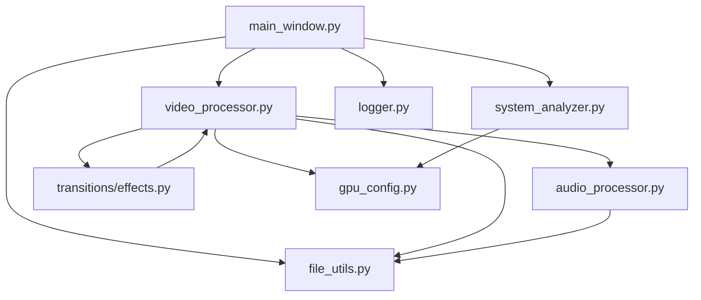

# 视频混剪工具系统设计蓝图

@design.md init
类型: 系统蓝图
项目: 视频混剪工具
架构设计:
- 系统架构
  - 核心模块
  - 依赖关系
- 模块详解
  - 文件处理模块
  - 视频处理模块
  - 音频处理模块 
  - 用户界面模块
  - 系统分析模块
- 关键实现
- 扩展接口
- 最佳实践

## 系统架构

### 核心模块
```
src/
├── core/                # 核心处理模块
│   ├── video_processor.py  # 视频处理核心
│   └── audio_processor.py  # 音频处理核心
├── ui/                  # 界面模块
│   └── main_window.py     # 主窗口实现
├── transitions/         # 转场特效模块
│   ├── __init__.py       # 模块初始化
│   └── effects.py        # 各种转场效果实现
├── hardware/            # 硬件管理模块
│   ├── __init__.py       # 模块初始化
│   ├── gpu_config.py     # GPU配置管理
│   └── system_analyzer.py # 系统分析器
└── utils/              # 工具模块
    ├── __init__.py      # 模块初始化
    ├── file_utils.py    # 文件处理工具
    └── logger.py        # 日志系统
```

### 依赖关系


## 模块详解

### 文件处理模块 (src/utils/file_utils.py)

#### 媒体文件识别系统
- **设计理念**: 简化验证、提高兼容性、健壮性
- **核心实现**:
  ```python
  def list_media_files(directory: Path) -> Dict[str, List[Path]]:
      """
      列出指定目录下的媒体文件，分类为视频和音频
      - 使用扩展名进行快速初步识别
      - 支持递归子目录搜索
      - 返回分类后的媒体文件字典
      """
      # 视频和音频扩展名列表
      video_extensions = ['.mp4', '.mov', '.mkv', '.avi', '.wmv', '.flv', '.webm']
      audio_extensions = ['.mp3', '.wav', '.ogg', '.flac', '.aac', '.m4a']
      
      # 获取所有符合扩展名的文件
      videos = list_files(directory, extensions=video_extensions, recursive=recursive)
      audios = list_files(directory, extensions=audio_extensions, recursive=recursive)
      
      return {
          'videos': videos, 
          'audios': audios
      }
  ```
- **优化策略**:
  - 简单扩展名检查：基于扩展名快速筛选文件
  - 仅验证视频文件能否被OpenCV正常打开，不进行复杂验证
  - 减少不必要的验证步骤，提高扫描速度
  - 更包容的错误处理，避免因单个文件问题中断整个处理流程
- **注意事项**:
  - 视频文件验证仍可能因格式问题失败
  - 用户应确保视频文件编码格式标准

#### 文件系统操作工具集
- **设计理念**: 安全、原子性、可恢复
- **核心功能**:
  - 文件复制与移动 (`copy_files`, `move_files`)
  - 临时文件管理 (`create_temp_file`, `create_temp_dir`)
  - 目录结构维护 (`ensure_dir_exists`, `clean_temp_dir`)
  - 文件大小获取 (`get_file_size`)
- **错误处理**:
  - 文件锁定检测
  - 权限问题处理
  - 磁盘空间检查

### 视频处理模块 (src/core/video_processor.py)

#### 视频合成系统
- **设计理念**: 高效、低内存占用、可中断、分段式合成、随机化选择
- **核心实现**:
  ```python
  class VideoProcessor:
      """
      视频处理核心类
      - 流式处理
      - 支持中断恢复
      - 智能资源管理
      - 分段式合成
      - 随机视频选择
      """
      def process_batch(self, material_folders: List[Dict[str, Any]], 
                       output_dir: str, 
                       count: int = 1, 
                       bgm_path: str = None) -> List[str]:
          """批量处理视频，支持进度报告和中断"""
      
      def _process_single_video(self, 
                              material_data: Dict[str, Dict[str, Any]], 
                              output_path: str, 
                              bgm_path: str = None) -> str:
          """处理单个视频合成，包括视频选择、裁剪和音频合成"""
          
      def _scan_material_folders(self, material_folders: List[Dict[str, Any]]) -> Dict[str, Dict[str, Any]]:
          """
          扫描素材文件夹，获取视频和配音文件
          
          支持两种导入模式：
          1. 直接导入独立场景文件夹（原有模式）
          2. 导入父文件夹，从中提取按顺序排列的子文件夹作为场景（新模式）
          """
  ```
- **导入与排序机制**:
  - 支持父文件夹导入模式，自动识别子文件夹作为段落
  - 子文件夹按名称排序确保视频段落有序
  - 从每个子文件夹的视频中随机选择一个，避免重复内容
- **优化策略**:
  - 分片处理：按场景分片处理视频
  - 内存管理：及时释放不需要的资源
  - 硬件加速：支持NVIDIA、Intel、AMD三种GPU加速
  - 两种导入模式兼容：直接导入独立场景或导入父文件夹
  - 文件夹结构标准化：每个段落文件夹包含"视频"和"配音"子文件夹
  - 段落索引化：使用索引确保严格按序合成
- **注意事项**:
  - 视频选择优先考虑未使用过的视频，避免重复
  - 优先选择时长足够的视频，必要时可使用较短视频
  - 文件夹命名应符合排序规则，确保正确的段落顺序

#### FFmpeg路径管理系统
- **设计理念**: 灵活、容错、兼容多平台
- **核心实现**:
  ```python
  def _get_ffmpeg_cmd(self):
      """
      获取FFmpeg命令路径
      
      Returns:
          str: FFmpeg可执行文件路径
      """
      ffmpeg_cmd = "ffmpeg"  # 默认命令
      
      # 尝试从配置文件读取自定义路径
      try:
          project_root = Path(__file__).resolve().parent.parent.parent
          ffmpeg_path_file = project_root / "ffmpeg_path.txt"
          
          if ffmpeg_path_file.exists():
              with open(ffmpeg_path_file, 'r', encoding="utf-8") as f:
                  custom_path = f.read().strip()
                  if custom_path and os.path.exists(custom_path):
                      # 在Windows处理中文路径
                      if os.name == 'nt':
                          import win32api
                          custom_path = win32api.GetShortPathName(custom_path)
                      ffmpeg_cmd = custom_path
      except Exception as e:
          logger.error(f"读取自定义FFmpeg路径时出错: {str(e)}")
      
      return ffmpeg_cmd
  ```
- **优化策略**:
  - 灵活配置：支持通过外部文件配置FFmpeg路径
  - 平台兼容：处理不同操作系统的路径差异
  - 中文路径处理：在Windows系统下转换为短路径名，避免编码问题
  - 异常处理：在读取配置失败时优雅降级，使用默认路径
- **注意事项**:
  - 在Windows系统中，中文路径可能导致FFmpeg调用失败
  - 若用户没有管理员权限，可通过配置文件指定自定义FFmpeg路径
  - 路径检测机制可确保选择有效的FFmpeg可执行文件

#### GPU加速编码系统
- **设计理念**: 自适应、兼容多种GPU、高性能与兼容性平衡
- **核心实现**:
  ```python
  def _encode_with_ffmpeg(self, input_path, output_path, hardware_type="auto", codec="libx264"):
      """
      使用FFmpeg进行视频编码，支持硬件加速
      
      Args:
          input_path: 输入文件路径
          output_path: 输出文件路径
          hardware_type: 硬件加速类型 (nvidia/intel/amd/auto/none)
          codec: 视频编码器
          
      Returns:
          bool: 编码是否成功
      """
      # 获取FFmpeg路径
      ffmpeg_cmd = self._get_ffmpeg_cmd()
      
      # 根据硬件加速设置选择合适的编码器
      if hardware_type != "none" and hardware_type != "":
          if "nvidia" in hardware_type or "auto" == hardware_type:
              codec = "h264_nvenc"
          elif "intel" in hardware_type:
              codec = "h264_qsv"
          elif "amd" in hardware_type:
              codec = "h264_amf"
      
      # 检查是否启用了兼容模式
      compatibility_mode = True  # 默认启用兼容模式
      try:
          from hardware.gpu_config import GPUConfig
          gpu_config = GPUConfig()
          compatibility_mode = gpu_config.is_compatibility_mode_enabled()
      except Exception as e:
          logger.warning(f"读取GPU兼容模式设置时出错: {str(e)}，将使用默认兼容模式")
      
      # 根据不同GPU类型和兼容模式设置优化参数
      if "nvenc" in codec:  # NVIDIA参数
          if compatibility_mode:
              gpu_params = [
                  "-c:v", codec,
                  "-preset", "p4",  # 兼容性好的预设
                  "-b:v", f"{self.settings['bitrate']}k",
                  "-spatial-aq", "1",
                  "-temporal-aq", "1"
              ]
          else:
              gpu_params = [
                  "-c:v", codec,
                  "-preset", "p2",
                  "-tune", "hq",
                  "-b:v", f"{self.settings['bitrate']}k",
                  "-rc", "vbr",
                  "-multipass", "2",
                  "-spatial-aq", "1",
                  "-temporal-aq", "1",
                  "-cq", "19"
              ]
      else if codec == "h264_qsv":  # Intel参数
          # Intel特定参数设置
      else if codec == "h264_amf":  # AMD参数
          # AMD特定参数设置
      
      # 执行编码并监控进度
      # ... 略 ...
  ```
- **优化策略**:
  - 自动适配：根据GPU类型自动选择最佳编码器
  - 兼容模式：提供兼容较旧驱动的参数设置
  - 实时监控：记录GPU状态、利用率及编码性能
  - 参数优化：为不同GPU提供针对性的编码参数
  - 错误处理：详细日志记录，便于调试编码问题
- **进度监控实现**:
  ```python
  def progress_monitor():
      """监控编码进度并更新UI"""
      start_time = time.time()
      while process.poll() is None and not self.stop_requested:
          elapsed = time.time() - start_time
          # 根据时间估算进度
          progress = min(99, (elapsed / estimated_duration) * 100)
          self.report_progress(f"正在导出视频... {progress:.1f}%", progress)
          time.sleep(1)
  
  # 在单独线程中启动监控
  monitor_thread = threading.Thread(target=progress_monitor)
  monitor_thread.daemon = True
  monitor_thread.start()
  ```
- **GPU状态监控**:
  ```python
  def _log_gpu_info(self, stage=""):
      """记录GPU状态信息"""
      try:
          # 使用nvidia-smi命令获取GPU利用率
          utilization_cmd = ["nvidia-smi", "--query-gpu=utilization.gpu,utilization.memory",
                           "--format=csv,noheader,nounits"]
          output = subprocess.check_output(utilization_cmd, universal_newlines=True)
          
          # 获取编码器会话信息
          encoder_cmd = ["nvidia-smi", "--query-gpu=encoder.stats.sessionCount,encoder.stats.averageFps",
                        "--format=csv,noheader,nounits"]
          encoder_output = subprocess.check_output(encoder_cmd, universal_newlines=True)
          
          # 记录GPU状态
          logger.info(f"GPU状态({stage}) - 利用率: {gpu_util}%, 显存: {mem_util}%, 编码会话: {session_count}, 帧率: {avg_fps} fps")
      except Exception as e:
          logger.debug(f"记录GPU信息时出错: {str(e)}")
  ```
- **编码器支持**:
  - NVIDIA GPU: h264_nvenc/hevc_nvenc
  - Intel GPU: h264_qsv/hevc_qsv
  - AMD GPU: h264_amf/hevc_amf
  - CPU: libx264/libx265 (无硬件加速时)
- **注意事项**:
  - 各硬件厂商的加速参数有较大差异
  - 部分系统（如Windows远程桌面）对硬件加速支持有限制
  - 需确保GPU驱动版本与FFmpeg版本兼容
  - 编码过程消耗大量GPU资源，可能影响系统其他部分性能

#### 转场效果系统 (src/transitions/effects.py)
- **设计理念**: 模块化、可扩展、防重复
- **核心实现**:
  ```python
  class TransitionEffect:
      """
      转场效果基类
      - 支持自定义效果
      - 参数可配置
      - 性能优先
      """
      
  class FadeTransition(TransitionEffect):
      """淡入淡出转场效果"""
      
  class MirrorFlipTransition(TransitionEffect):
      """镜像翻转转场效果"""
  ```
- **支持的效果类型**:
  - 淡入淡出
  - 镜像翻转
  - 色相偏移
  - 像素化
  - 旋转缩放
  - 速度波动
  - 分屏滑动
  - 不使用转场（直接拼接）

### 音频处理模块 (src/core/audio_processor.py)

#### 音频混合系统
- **设计理念**: 可配置、保真度高
- **核心实现**:
  ```python
  class AudioProcessor:
      """音频处理核心类"""
      
      def mix_audio(self, audio_paths: List[str], volumes: List[float] = None) -> str:
          """混合多个音频文件"""
          
      def add_bgm(self, audio_path: str, bgm_path: str, voice_volume: float = None,
                bgm_volume: float = None) -> str:
          """添加背景音乐到人声音频"""
  ```
- **主要功能**:
  - 音频提取
  - 音量调整
  - 静音检测
  - 音频分割
  - 音高变化
  - 速度调整
  - 音频标准化

### 硬件管理模块 (src/hardware/)

#### GPU配置管理系统 (src/hardware/gpu_config.py)
- **设计理念**: 自动检测、智能配置、最佳性能
- **核心实现**:
  ```python
  class GPUConfig:
      """GPU硬件加速配置管理类"""
      
      def __init__(self):
          """初始化GPU配置类"""
          # 默认配置与配置加载逻辑
          
      def detect_and_set_optimal_config(self):
          """检测GPU并设置最优配置"""
          
      def _set_nvidia_config(self):
          """设置NVIDIA GPU的特定配置"""
          
      def _set_amd_config(self):
          """设置AMD GPU的特定配置"""
          
      def _set_intel_config(self):
          """设置Intel GPU的特定配置"""
      
      def is_compatibility_mode_enabled(self):
          """检查兼容模式是否启用"""
  ```
- **优化策略**:
  - 自动识别：检测系统中可用的GPU并确定类型
  - 智能配置：根据GPU类型和驱动版本选择最佳参数
  - 兼容模式：为旧版驱动提供更保守的参数设置
  - 持久化配置：将设置保存到配置文件，避免重复检测
- **支持的GPU类型**:
  - NVIDIA: GeForce系列、Quadro系列
  - AMD: Radeon系列
  - Intel: 集成显卡
- **注意事项**:
  - 远程桌面会话可能影响GPU检测
  - 不同型号、驱动版本的GPU需要不同的参数设置
  - 兼容模式可能降低性能但提高稳定性

#### 系统分析模块 (src/hardware/system_analyzer.py)
- **设计理念**: 全面、准确、低资源占用
- **核心实现**:
  ```python
  class SystemAnalyzer:
      """系统硬件分析器"""
      
      def analyze(self):
          """分析系统硬件配置"""
          
      def get_optimal_settings(self):
          """获取最优设置"""
          
      def _check_ffmpeg(self):
          """检查FFmpeg可用性和支持的编码器"""
          
      def _analyze_gpu_capabilities(self, gpu):
          """分析GPU的编解码能力"""
          
      def _analyze_ffmpeg_gpu_compatibility(self, gpu_info):
          """分析FFmpeg与GPU的兼容性"""
  ```
- **检测范围**:
  - CPU信息: 型号、核心数、频率
  - GPU信息: 型号、显存、支持的硬件加速
  - 内存信息: 总量、可用量
  - 存储信息: 容量、剩余空间、读写速度
  - 操作系统信息
  - FFmpeg可用性与编码器支持检测

### 用户界面模块 (src/ui/main_window.py)

#### 界面布局系统
- **设计理念**: 清晰、易用、现代化、精简
- **核心组件**:
  - 素材列表
  - 预览窗口
  - 控制面板
  - 菜单栏
- **核心实现**:
  - 移除冗余的"文字模式"选项，默认使用"配音模式"
  - 在转场效果下拉菜单中添加"不使用转场"选项
  - 实现无转场模式下的快速视频拼接
- **优化策略**:
  - 减少不必要的用户选择，简化操作流程
  - 添加无转场选项，提高视频生成速度
  - 保持界面视觉一致性
- **注意事项**:
  - 无转场模式会导致视频片段直接拼接，可能出现明显切换
  - 默认首选项设置为最常用选项，减少用户操作
- **交互设计**:
  - 快捷键支持
  - 上下文菜单
  - 状态栏反馈

#### 拖拽导入系统
- **设计理念**: 直观、响应快、用户友好
- **核心实现**:
  ```python
  def dragEnterEvent(self, event):
      """处理拖拽进入事件"""
      
  def dropEvent(self, event):
      """处理拖放事件"""
      
  def _handle_overlay_drop(self, urls):
      """处理拖放覆盖层的文件放下操作"""
      
  def _process_dropped_items(self, paths):
      """处理拖放的文件夹"""
  ```
- **优化策略**:
  - 多层级接受: 窗口、中央部件和表格都接受拖拽
  - 视觉反馈: 使用样式表改变拖拽经过的组件样式
  - 异步处理大量文件
  - 清晰的视觉反馈
  - 进度显示
  - 松散约束: 接受多种文件夹结构，增强适应性
- **注意事项**:
  - 保持UI响应: 在处理文件的同时更新界面
  - 统一处理流: 使用通用方法处理所有拖拽操作
  - 全面日志: 记录每一步拖拽操作便于调试

## 关键实现

### 性能优化
- **内存管理**:
  - 使用生成器处理大文件
  - 实现资源池机制
  - 智能缓存策略
- **并行处理**:
  - 多线程任务分发
  - 进程池管理
  - 负载均衡
- **硬件加速**:
  - 自动检测可用GPU
  - 选择最优编码器
  - 动态调整线程数
  - 兼容模式适配旧驱动
  - 实时监控GPU利用率
  - 多厂商GPU支持（NVIDIA/AMD/Intel）

### 错误处理
- **异常恢复机制**:
  - 状态保存与恢复
  - 中断重试策略
  - 完整日志记录
- **用户反馈**:
  - 详细错误提示
  - 进度实时更新
  - 操作状态同步
- **FFmpeg问题处理**:
  - 路径检测与优雅降级
  - 编码器可用性验证
  - 编码过程中断恢复
  - 中文路径处理

### 视频文件处理最佳实践
- **设计策略**:
  - 两阶段验证: 扩展名检查 + 需要时验证
  - 文件操作安全性: 使用临时文件并检查写入权限
  - 充分的错误处理: 每个文件操作都有异常捕获
  - 视频编码优化: 根据内容自动选择合适的编码参数
  - GPU加速流程: 检测 → 配置 → 监控 → 调优

## 扩展接口

### 插件系统
- **设计理念**: 可扩展、松耦合
- **接口定义**:
  ```python
  class PluginBase:
      """
      插件基类
      - 标准化接口
      - 生命周期管理
      - 资源隔离
      """
  ```

### 配置系统
- **设计理念**: 灵活、持久化、用户友好
- **核心功能**:
  - 参数管理
  - 配置持久化
  - 默认值处理

## 最佳实践

### 开发规范
- **代码风格**: PEP 8
- **文档要求**: 中文注释
- **测试覆盖**: 单元测试
- **代码结构**:
  - 使用4空格缩进
  - 类方法顺序: 初始化、公共接口、私有方法
  - 错误处理: 先检查参数，后执行逻辑

### 拖拽系统最佳实践
- **设计理念**: 直观、自然、反应迅速
- **实现技巧**:
  - 多层级接受: 窗口、中央部件和表格都接受拖拽
  - 视觉反馈: 使用样式表改变拖拽经过的组件样式
  - 松散约束: 接受多种文件夹结构，增强适应性
- **注意事项**:
  - 保持UI响应: 在处理文件的同时更新界面
  - 统一处理流: 使用通用方法处理所有拖拽操作
  - 全面日志: 记录每一步拖拽操作便于调试

### 硬件加速最佳实践
- **设计理念**: 自适应、兼容性优先、性能优化
- **实现技巧**:
  - 动态检测: 运行时自动识别可用GPU
  - 多级降级: 硬件不可用时有序降级到备选方案
  - 参数持久化: 在配置文件中保存硬件加速设置
  - 编码器验证: 确保选择的编码器在当前环境可用
- **注意事项**:
  - 远程会话兼容: 特别处理远程桌面环境下的GPU检测
  - 驱动版本适配: 根据驱动版本选择兼容的编码参数
  - 资源监控: 定期检查GPU使用率避免过载
  - 编码质量平衡: 在性能和质量间寻找平衡点

### 部署建议
- **环境配置**:
  - Python 3.8+
  - 预安装FFmpeg
  - 推荐GPU支持
- **依赖管理**:
  - 使用requirements.txt固定版本
  - 最小化依赖数量
  - 处理平台差异: Windows/MacOS/Linux
- **性能调优**:
  - 根据SystemAnalyzer自动调整参数
  - 预设配置文件满足不同硬件配置
  - 资源限制保护策略